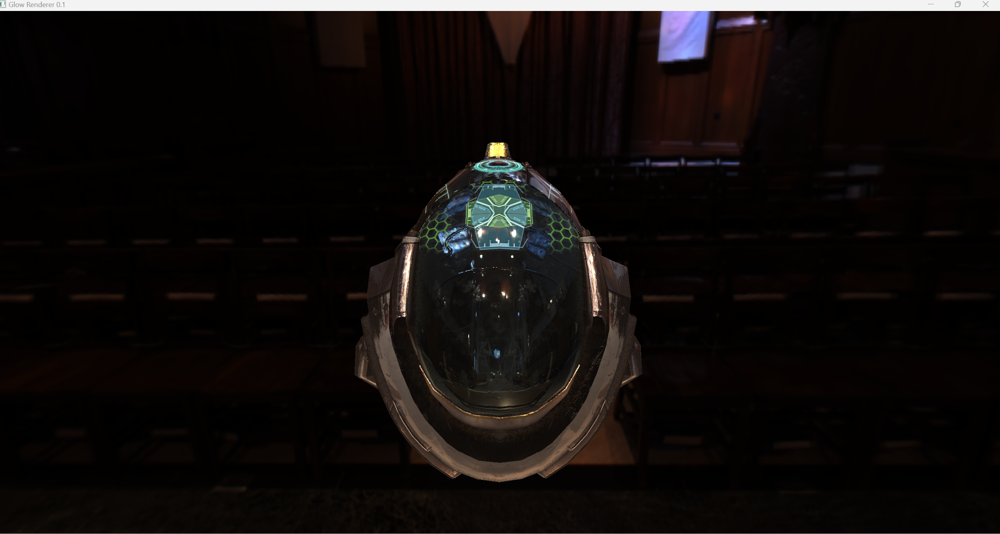

# Glow Renderer

A (wip) PBR renderer written in C++. Support PBR materials with IBL diffuse and specular lighting.

## build

```bash
git clone https://github.com/eddychu/glow.git --recursive

# or if you already cloned the repo without --recursive
# git submodule update --init --recursive

cd glow

mkdir build

cd build

cmake ..

```

## Screenshot


